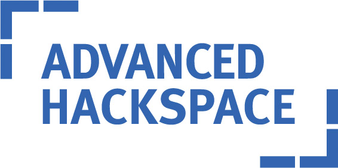

# CDT-Physical-Computing

## Find me at http://bit.ly/2FHvwRo

    

# Introduction

Welcome to this tutorial about the Raspberry Pi microcomputer and its amazing capabilities. This tutorial intends to offer you:

1. An overview of Raspberry Pi – one of the most popular microcomputers in use today.
2. A toe-dipping introduction to the Python programming language.
3. An understanding of Raspberry Pi's physical pins, which we can use to make it talk to all sorts of electronics – from within our Python programs!

It may also be useful as a reference during our hackathon.