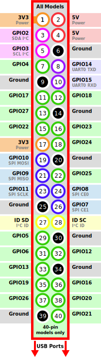
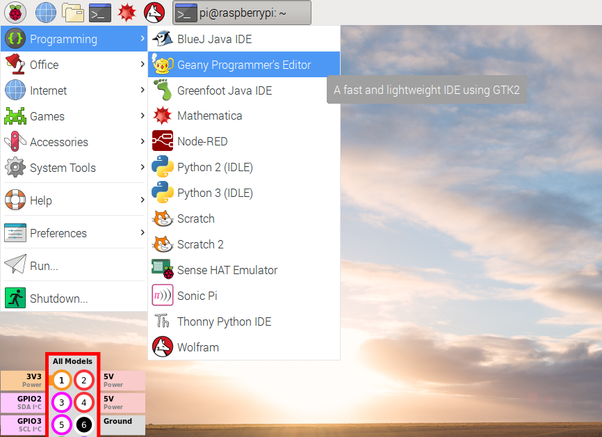
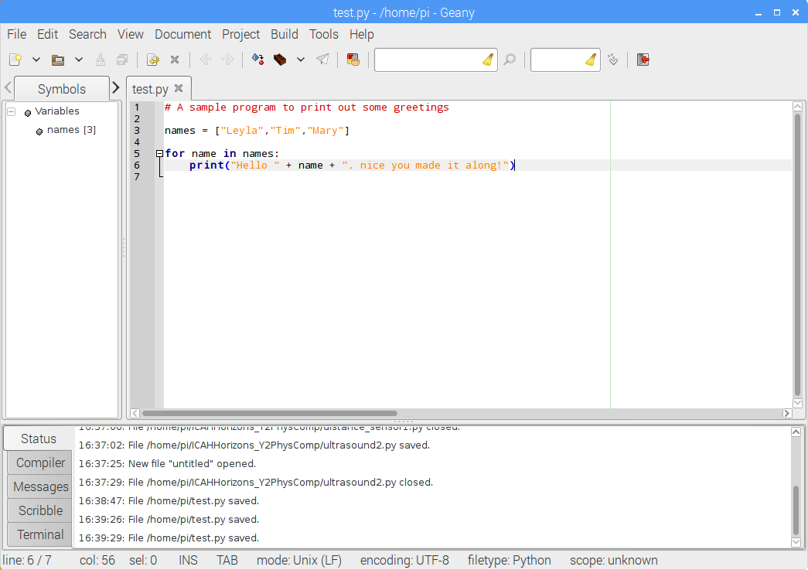

# CDT-Physical-Computing

## Find me at http://bit.ly/2FHvwRo

<p align="center">
    
</p>

# Introduction

Welcome to this tutorial about the Raspberry Pi microcomputer and its amazing capabilities. This tutorial intends to offer you:

1. An overview of Raspberry Pi – one of the most popular microcomputers in use today.
2. A toe-dipping introduction to the Python programming language.
3. An understanding of Raspberry Pi's physical pins, which we can use to make it talk to all sorts of electronics – from within our Python programs!

It may also be useful as a reference during our hackathon.

We will work through this sheet as follows. For each of the following chapters, the tasks are grouped into **ascending order of difficulty**. Please attempt all tasks under **Mandatory exercises**, and if you have time before we move on, have fun with the **Optional exercises**.

**One plea**: If you are done earlier than your neighbour, please help us out by offering your help to them. Explaining something is a sure-fire way to really understand it yourself!

# An Overview of the Raspberry Pi (RPi)

## What is the Raspberry Pi?

Raspberry Pi is a small computer the size of a credit card that you can plug into a monitor, keyboard and mouse. You can use it in the same way as you would use your desktop PC or laptop. You can generate spreadsheets, do word processing, browse the internet, and play games. It also plays high-definition video.

However, what will make it interesting for us is its capability for use in electronics projects! The main aim of the Raspberry Pi is to teach anyone how to use programming and electronics to realise their ideas. Raspberry Pi comes with a free Linux operating system that runs from an SD card, and it is powered by a USB phone charger.

<p align="center">
    
    <figcaption align="center">The Raspberry Pi (version 3)</figcaption>
</p>

## Models of Raspberry Pi

Since its original launch in 2012 there have been a number of different models with the most recent model having a quad core processor runnning at 1.4GHz and with 1GB of RAM.

<p align="center">
    
</p>
<p align="center">
    
    <figcaption align="center">Different Raspberry Pi models through the years</figcaption>
</p>

We will be working with the RPi 3 Model B which is based around a 1.2 GHz 64-bit quad-core ARM Cortex-A53 processor, has 1GB of RAM, while the smaller and cheaper Zero W is based on a 1 GHz single-core ARM1176JZF-S processor with 512GB RAM. Both have 802.11n Wireless and Bluetooth 4.1 included on the chip. Look at them – all of this is included in those black chips soldered onto the boards! That's also why we call these little wonders "System on a Chip" – the entire computer system resides in silicon.

## Physical layout of Raspberry Pi

<p align="center">
    
    <figcaption align="center">Raspberry Pi Layout</figcaption>
</p>

The above picture shows a Raspberry Pi 3. On the right-hand side, you have four **USB ports** and one **Ethernet** port. Next to the USB ports, there is a **USB/Ethernet Controller**, which translates data between the ports and the main processor, because the processor itself doesn't understand the USB or Ethernet protocol. At the top, you can find the **General Purpose Input/Output (GPIO) pins** (40 of them to be precise). Down the bottom middle is the **CSI (Camera Serial Interface) connector**, which allows you to connect mobile-phone-style cameras directly to the Pi. Of course, you also have the option to connect a webcam via USB. At the right-hand side, you can find a **DSI (Display Serial Interface) connector** that you can use to connect an LCD screen. At the bottom, you can find the **HDMI port**, which allows you to connect the Pi straight into a monitor. Next to this port, you can see the **USB power connector** and also an **audio port**. The back side of the Pi houses a micro SD card slot for the SD card containing the operating system and user data – just like a classical hard disk.

## Important Note

Before we continue, please be aware of the following limitations when using your Raspberry Pi.

* Always make sure you supply only 5V to the RPi.
* Unlike Arduino, RPi does not have over-voltage protection on the board (yet), so be careful when making GPIO connections.
* Never connect more than a potential difference of 3.3V to the GPIO pins (for example, when using sensors to feed data into the Pi).
* Never demand that any GPIO pin source or sink more than 16mA.
* Pins can only supply a maximum current of 50mA.

During this workshop, if you are unsure about connecting something new to your Raspberry Pi (particularly anything feeding a voltage or a current into it), do come and ask one of us mentors first – it might prevent your board from frying! Let us now consider what we _can_ do with those pins!

## General Purpose I/O Pins (GPIO)

Your Raspberry Pi is more than just a small computer; it is a hardware prototyping tool! The RPi has **bi-directional I/O pins**, which you can use to drive LEDs, spin motors, or read button presses. Using these pins requires a bit or programming. While you can use a [variety of programming languages](http://elinux.org/RPi_Low-level_peripherals#GPIO_Code_examples) to \"do\" GPIO, we will use a reliable, easy-to-use language throughout this hackathon: **Python**.

###  GPIO Pinout

As we saw above, the GPIO is arranged as a header of 40 electrical pins, which makes it easy to connect it with an external circuit, using jumper wires.

<p align="center">
    
    <figcaption align="center">Raspberry Pi GPIO Orientation</figcaption>
</p>

<p align="center">
    
    <figcaption align="center">Raspberry Pi GPIO Layout</figcaption>
</p>

The image also shows the additional data protocols that can be accessed through some of the GPIO pins: [Serial (UART)](https://learn.sparkfun.com/tutorials/serial-communication), [I2C](https://learn.sparkfun.com/tutorials/i2c), [SPI](https://learn.sparkfun.com/tutorials/serial-peripheral-interface-spi), Pulse width modulation ([PWM](https://learn.sparkfun.com/tutorials/pulse-width-modulation). We will actually use the I2C protocol to control an external circuit board for DC motors later.

# The tools of the trade - the Linux terminal, a code editor and SSH

But how about (a) writing, and (b) executing Python programs on the Rasberry Pi?

For writing programs, we suggest using **Geany**, which is one of the pre-installed code editors on your Raspberry Pi. It has the handy feature that it highlights (i.e., colour-annotates) our programs as we write them, which helps a lot with their readability.

You find Geany in the Programming menu, as shown in the following picture.

<p align="center">
    
    <figcaption align="center">Opening the Geany script editor</figcaption>
</p>

The user interface is rather self-explanatory, with commands like CTRL+S (save), CTRL+O (open a file) etc. working as expected. It looks like shown below. Note that the program text has been coloured automatically.

<p align="center">
    
    <figcaption align="center">The Geany user interface</figcaption>
</p>

Alternatively you can create the programs on your own laptop and copy them over to the raspberry pi over SSH (Secure Socket Shell). For our sessions we will use repl.it which is an online IDE that can interpret and compile your code. Using this we do not have to worry about what operating system we are on and installing any new software. Simply write the code online, download it and copy it across as shown below.

But how to actually run the program, so the computer can do what we ask it to do? That's where the Linux terminal comes in handy. Look again at the main menu bar in the Figure above. The terminal is the black symbol with <kbd>**>\_**</kbd> in it, at the top of the screen. Once you've clicked on it, the below window appears.

<p align="center">
    
    <figcaption align="center">The Linux terminal</figcaption>
</p>

We will show you how you can run a program from within the Terminal. The most important Terminal commands are listed in the table below.

| Command       | Effect     | 
| ------------- |:-------------| 
| ```ls``` | List the contents of the current folder |
| ```cd``` _folder_ | **C**hange **d**irectory into _folder_ |
| ```cd ..``` | Change into the parent folder of the current folder |
| ```cd``` | ```cd``` without argument changes back to the user's home folder (/home/pi) |
| ```pwd``` | **P**resent **w**orking **d**irectory. This prints out the location of the current folder. |
| ```python3``` _program.py_ | Run the program called _program.py_ in Python 3 |

Hint: You can use tab completion. For example, when typing ```cd```+<kbd>Tab</kbd>, the Terminal automatically lists all possible folders that are available for changing into.

Long story short - the Terminal is much like a text-based file explorer, bolted together with a powerful general "command centre" for your computer. You can also start the usual programs from within the terminal. Just type ```chromium```+<kbd>Enter</kbd>.

## SSH: Secure Socket Shell

Raspberry Pis are great for electronics projects - they're quick and easy to use and can be set up to work headless i.e. they can work without a screen. Although this is a little more difficult to work with it makes it great when we want to update code on the Raspberry Pi while it is buried in the middle of our projects. To access our pi without a screen we can use SSH, which forms a secure connection between your device and the pi and provides you access to the command line on the Raspberry Pi.

Normally you can connect to a pi over SSH that is on the same network, for example at home if your pi is connected to your wifi and so is your laptop, you can connect to it over SSH by simply typing ssh pi@PI_IP_ADDRESS in a terminal (Linux/Mac) or using a program like PuTTy (windows).

In our case there are some further difficulties as we do not know the IP address of the pi on the Imperial-WPA network hence we are using the Raspberry Pi as a Wireless Access Point (WAP). This allows us to connect directly to the raspberry pi like we connect to a wifi network. Each of you will be given a pi with a number on top, dictating the wifi SSID to connect to.

Now connect up the 5V power adapter to the pi and turn it on. A red light should come on and a flashing green light. After roughly 20 seconds the Raspberry pi will have completed booting. Now see on your laptops wifi connection - has the raspberry pi SSID shown up? For example for the Raspberry Pi labelled 01 there should be a wifi connection called ```H2Pi01``` that you can connect to. Try connecting to this connection. The password is ```Horizons2```.

If you can connect to it you should be able to also SSH into the raspberry pi now. Try the following instructions:

### Linux/Mac:

Open a terminal and type in ```SSH pi@192.168.4.1```. If it asks you if you want to continue connecting then please type ```yes```+<kbd>Enter</kbd>. If it asks you for a password then try the default rapsberry pi password ```raspberry```.

### Windows:

Download PuTTy, an SSH and telnet client [here](https://www.chiark.greenend.org.uk/~sgtatham/putty/latest.html). After you have downloaded and installed PuTTy, try running it and you should be met with a screen as below:

<p align="center">
    
    <figcaption align="center">PuTTy: an SSH and telnet client</figcaption>
</p>

On the left hand bar select Session and fill in the details as follows: 

```
Hostname (or ip address):192.168.4.1
Port:22
Connection Type:SSH
```

You can even save this configuration so you can pull it up next time instead of typing it all out again. Now click ```Open``` and you should be met with a black terminal screen and you may get a popup asking if you are sure to connect. Click Yes. On the black terminal screen you will get a prompt for the login details:

```
login as: pi
password: raspberry
```

If all goes well you should be met with the screen below:

<p align="center">
    
    <figcaption align="center">Successfully SSH raspberry pi</figcaption>
</p>

## Working with files on the Pi

As you know we do not have a screen connected to the Raspberry Pi right now, which may confuse some of you for the next bit. Lets say we wanted to write some code and run it on the Pi. How would we do this? There are two ways we can use here, either we write the file on our own laptops in a text editor and copy it over, or we write it directly on the pi in the terminal. 

### Copying a file over to the Raspberry Pi

As some of you may find it is nicer to work within a known code editor that you are comfortable with. Once you have made this file on your laptop you can then copy this over to the Raspberry Pi and run it. So lets try this, create a simple text file called test_file.txt on the Desktop on your laptop.

Now lets copy your file over to the Raspberry Pi. We can do this using SCP (Secure File Copy). Don't forget to connet to your RPi network again before trying the next steps.

If you are using Mac/Linux then you do not require any extra software. Simply open a terminal and change directory to the Desktop and type:

```scp test_file.txt pi@192.168.4.1:/home/pi/Desktop```

If you are using Windows then you will need the program PuTTy which we mentioned in the previous lesson. You can download it [here](https://www.chiark.greenend.org.uk/~sgtatham/putty/latest.html). Download the MSI('Windows Installer') and install it.

Once you have installed PuTTy you can open the command prompt in Windows and change directory to the Desktop. Now use the pscp command to transfer the file.

```pscp -scp test_file.txt pi@192.168.4.1:/home/pi/Desktop```

Now if you ssh into your Raspberry Pi and list the files in the Desktop folder you will see your text file has been copied across!

### Using a file editor on the Raspberry Pi

If you wanted you could also create and edit a file directly on the RPi. Lets try this. First SSH into the RPi:

```ssh pi@192.168.4.1```

Then change directory to the Desktop folder. Now we are going to use one of the built in file editors for Linux systems called Nano. It is a very nice and easy terminal text editor. So to run it type:

```nano test_file.txt```

This will open a text editor in your terminal as shown below:

<p align="center">
    
    <figcaption align="center">Nano in the terminal</figcaption>
</p>

Note that within this text editor you cannot just click where you want to go but have to move there using the keypad on your keyboard. Then you can type whatever you need so lets try typing ```Hello World!``` at the top of the file and to exit you click <kbd>CTRL</kbd>+<kbd>X</kbd> on your keyboard. Click <kbd>y</kbd> and <kbd>Enter</kbd> to save it under the same file name.


However, before we get to that, we need to learn the basics of Python programming.